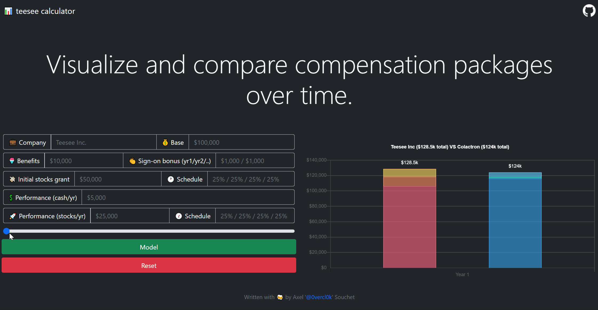

# &#128202; teesee-calc

<a href='https://0vercl0k.github.io/teesee-calc'>0vercl0k.github.io/teesee-calc</a>

## Overview

`Teesee` is a simple web application that allows you to visualize and compare total compensation packages. They can be confusing to understand and compare: multiple parameters, different vesting schedule, different benefits, etc.

Ultimately, every package is different but they usually all follow a common structure and use the same *ingredients*. `Teesee` breaks it down into into several parts (note that most of them are not mandatory):

- Base salary: this is a cash amount that you will receive every month.
- Benefits: this is your health insurance, 401k match, paid time-off, your free *whatever*. It is not cash but still has a monetary value that can vary quite a bit across companies.
- Sign-on bonuses: this is a fixed cash amount that usually gets unlocked over the year (every month for example, or one payment after signing the contract). Packages can include several of those (for year 2 for example).
- Initial stock grant: this is not a cash amount, but a number of shares that will vest over a period of time. The vesting schedule differs from company to company.
- Performance cash: this is a cash amount that is usually indexed on your performance for the past year and also depends on the level you were operating at. It usually happens once every year.
- Performance stock refresher: this can be another part of the performance rewards. It comes as a stock grant with a vesting schedule that can be different from the initial stock grant. This also usually happens every year.

Hopefully `Teesee` help you out visualize and take better decisions for your own short/long term professional career.

## References

- [Understand leveling and compensation in tech companies](https://www.levels.fyi/),
- [Understand total compensation](https://www.indeed.com/career-advice/pay-salary/salary-vs-total-compensation).

## Authors

Axel '[0vercl0k](https://twitter.com/0vercl0k)' Souchet